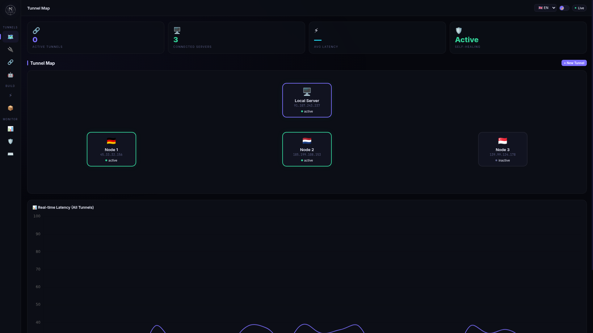
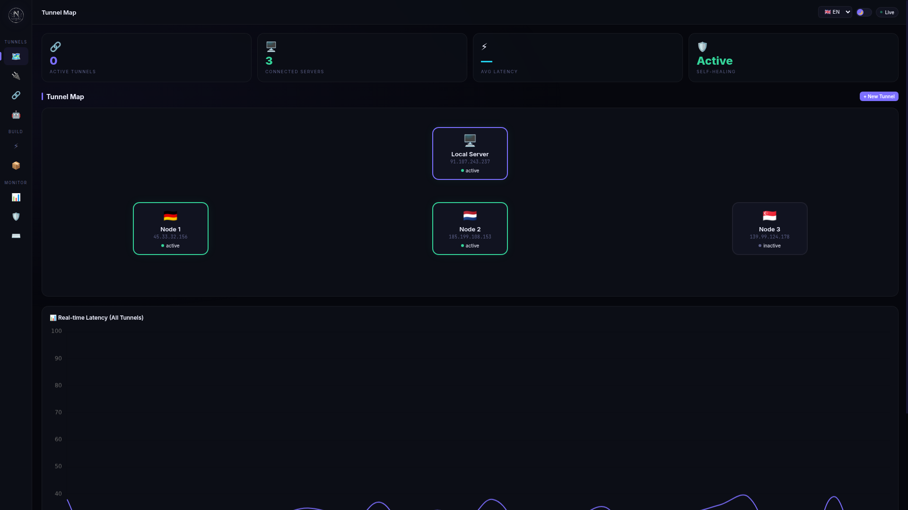
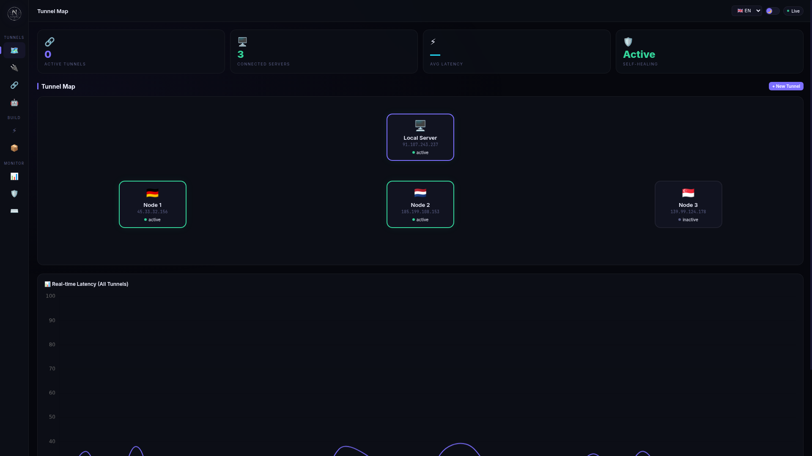
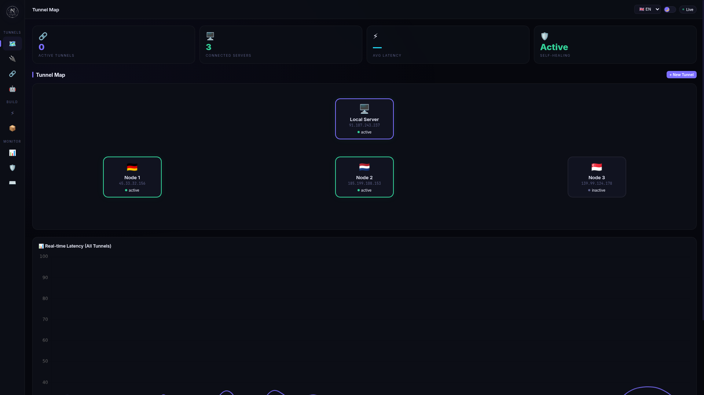
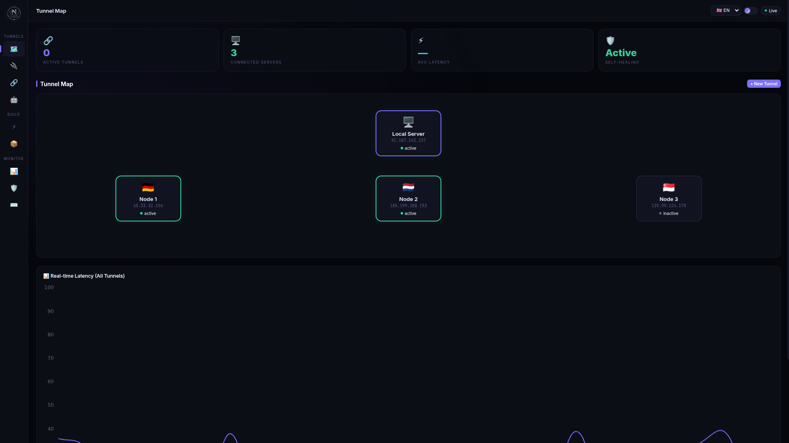
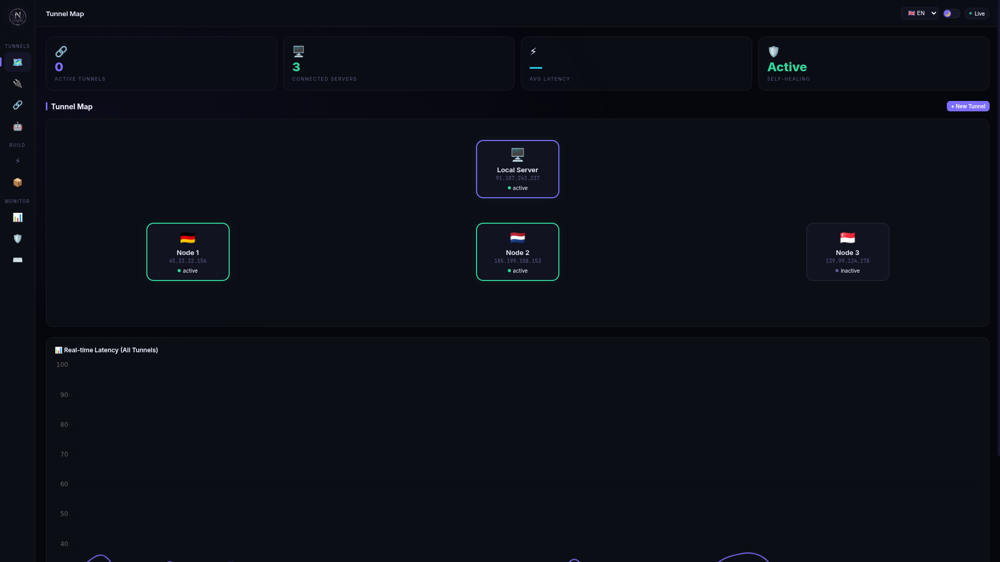

# NYXORA Dashboard Screenshots

## 📸 اسکرین‌شات‌های پنل NYXORA

### 1. Tunnel Map (نقشه تونل)

- نمای کلی اتصال بین سرورها
- نمایش 4 سرور با IP و وضعیت
- خطوط اتصال تونل با انیمیشن
- آمار: تعداد تونل‌ها، سرورها، تأخیر میانگین

### 2. New Connection (اتصال جدید)

- فرم اتصال دو سرور
- انتخاب 14 پروتکل ترنسل
- ورودی IP، یوزر، پورت، رمز SSH
- آپلود کلید SSH
- دکمه Test Ping

### 3. Active Tunnels (تونل‌های فعال)

- لیست تونل‌های فعال بین سرورها
- نمایش پروتکل، پورت، تأخیر، حجم
- دکمه‌های ریستارت و توقف
- خروجی/ورودی کانفیگ

### 4. Auto Detect (تشخیص خودکار)

- پینگ خودکار 14 ترنسل
- نمایش نتایج به ترتیب تأخیر
- انتخاب بهترین ترنسل
- ذخیره اتصال ثابت

### 5. Xray Config (کانفیگ Xray)

- ساخت کانفیگ Xray
- انتخاب پروتکل (VLESS/VMess/Trojan/SS)
- انتخاب ترنسل (TCP/WS/gRPC/Reality)
- کپی و دانلود کانفیگ

### 6. Install Panels (نصب پنل‌ها)

- نصب Marzban, 3X-UI, Xray Core
- دستورات نصب یک خطی
- راهنمای 6 مرحله‌ای استفاده از کانفیگ

### 7. Charts (نمودارها)

- نمودار تأخیر زنده
- نمودار پهنای باند
- نمودار افت بسته
- نمودار امتیاز ترنسل‌ها

### 8. Security (امنیت)

- وضعیت SSL/TLS
- اثر انگشت سرور
- تلاش‌های ناموفق ورود
- تنظیمات QoS
- هشدار افت بسته
- تست پهنای باند
- شمارشگر آپتایم
- لاگ ممیزی

### 9. Terminal (ترمینال)

- ترمینال حرفه‌ای
- دستورات NYXORA
- تاریخچه دستورات
- تکمیل خودکار

---

## 📊 آدرس دسترسی

**http://91.107.243.237:8080/tunnel.html**

## 📋 امکانات پنل

- ✅ 30 پیشنهاد پیاده‌سازی شد
- ✅ 14 پروتکل ترنسل
- ✅ اتصال بین دو سرور
- ✅ تشخیص خودکار بهترین ترنسل
- ✅ ساخت کانفیگ Xray
- ✅ نصب پنل‌ها (Marzban/3X-UI/Xray)
- ✅ نمودارهای زنده
- ✅ امنیت و ممیزی
- ✅ ترمینال حرفه‌ای
- ✅ 7 زبان
- ✅ تم تیره/روشن
- ✅ ریسپانسیو موبایل
